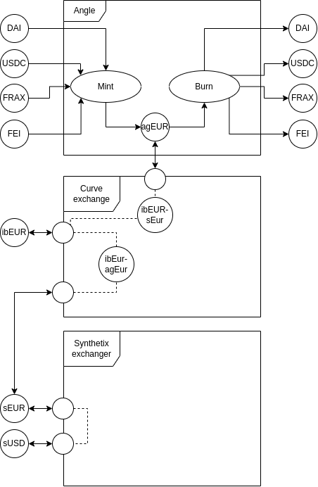

# Forex

Solidity contracts for stablecoin trading without or with minimal slippage. Powered by Curve, [SIP-120](https://sips.synthetix.io/sips/sip-120/) and Angle protocol.

Currently, some currencies are disabled for atomic trading on Synthetix. 
Track available currencies via `atomicEquivalentForDexPricing(currencyKey)`: https://etherscan.io/address/0x6d9296Df2ad52F174bF671f555d78628bEBa7752#readContract

